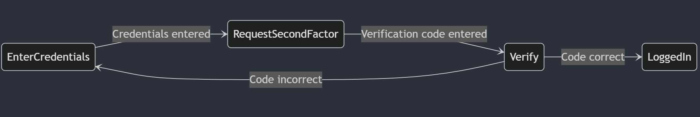
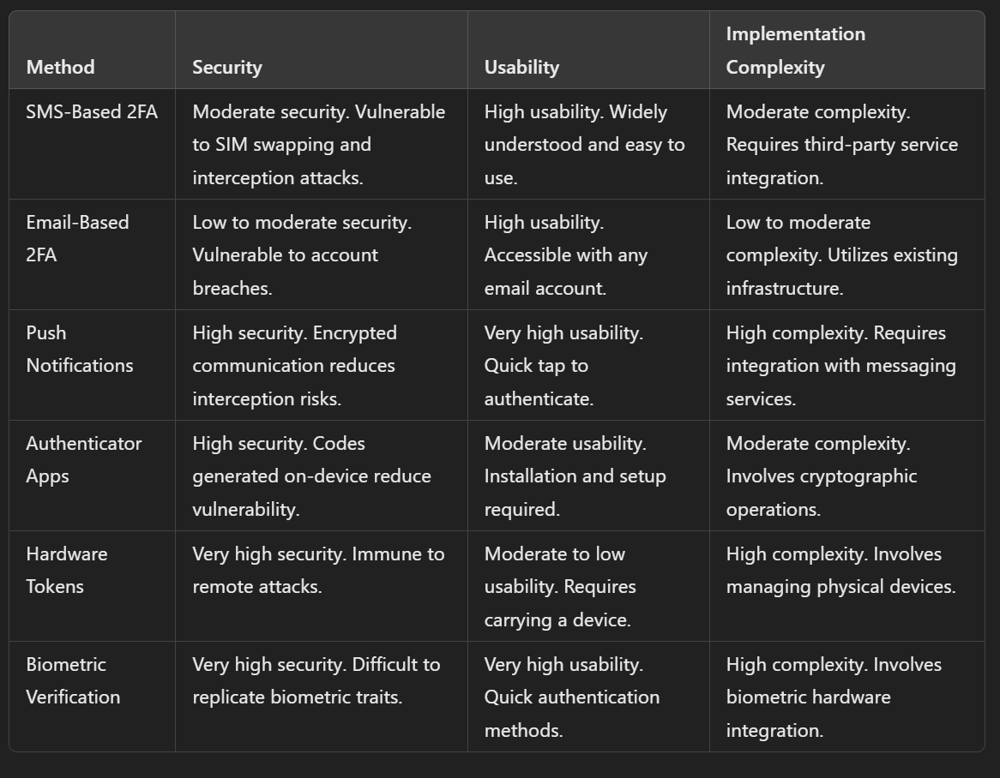

# Table of contents

- [Chapter II: Two-Factor Authentication (2FA) in Spring Boot](#chapter-ii-two-factor-authentication-in-spring-boot)
    * [Introduction](#introduction)
    * [How 2FA Works](#how-two-factor-authentication-works)
    * [Advantages and Challenges of 2FA](#advantages-and-challenges-of-2fa)
    * [Implementing TOTP 2FA in a Spring Boot Application](#implementing-totp-in-spring-boot)

    
    
# Chapter II: Two-Factor Authentication in Spring Boot

## Introduction

Two-Factor Authentication (2FA) is a security process that requires users to verify their identity using two different authentication factors before gaining access to an online account. This additional layer of security helps protect against unauthorized access resulting from compromised credentials: it is significantly more difficult for unauthorized individuals to gain access to sensitive information, even if they have the user's password.

In this chapter, we will explore how 2FA works and its implementation in a Spring Boot application.

### The Necessity of Two-Factor Authentication

Data breaches and security threats are becoming more sophisticated. Traditional username and password combinations often do not provide sufficient protection. Passwords can be weak, reused across multiple sites, or stolen through phishing attacks and data breaches. Two-Factor Authentication adds an extra layer of security by combining something the user knows (like a password) with something the user possesses (such as a code sent to a smartphone or an email), or something inherent to the user (like a fingerprint or face ID).

Moreover, many regulatory frameworks and compliance standards, such as **GDPR** and **PCI-DSS**, now require or recommend 2FA for protecting user data.

## How Two-Factor Authentication Works

2FA works by integrating two of the following three authentication factors:

1. **Knowledge Factors**: Something the user knows, such as a password or PIN.  
2. **Possession Factors**: Something the user has, like a security token, a smartphone app that generates time-limited codes, or a smart card.  
3. **Inherence Factors**: Something the user is, typically involving biometrics, such as fingerprints, facial recognition, or voice patterns.

In the realm of web application security, two-factor authentication (2FA) has emerged as a fundamental mechanism for enhancing user safety. It serves as a critical barrier against unauthorized access, significantly complicating the efforts of attackers who aim to gain control over user accounts solely through stolen passwords. For developers utilizing Spring Boot, the integration of 2FA not only fortifies applications but also conveys a message of trust to users, underscoring a dedication to the protection of their sensitive information.

Here is a visual representation of the 2FA process:
 


The typical 2FA process in web applications involves the user entering a password, followed by a verification code. This code can be delivered in several ways:

* ### **SMS-based Verification**: The user receives a code via text message after entering their password.

To send an SMS with a verification code using Twilio:  
**Dependency Configuration (pom.xml)**:  
```xml
<dependency>  
    <groupId>com.twilio.sdk</groupId>  
    <artifactId>twilio</artifactId>  
    <version>8.0.0</version>  
</dependency>
```
**Example Code**:

```java
public class SmsService {  
     public static final String ACCOUNT_SID = "your_account_sid";  
    public static final String AUTH_TOKEN = "your_auth_token";

    static { 
        Twilio.init(ACCOUNT_SID, AUTH_TOKEN);  
    }

    public void sendVerificationCode(String phoneNumber, String code) {  
        Message message = Message.creator( 
                new PhoneNumber(phoneNumber), // To  
                new PhoneNumber("your_twilio_number"), // From  
                "Your verification code is: " + code)  
                .create();

        System.out.println("SMS sent: " + message.getSid());  
    }  
}
```
* ### **Email-based Verification**: A code is sent to the user’s email, which must be entered on the site.
**Dependency Configuration (pom.xml)**: 
```xml
<dependency>  
    <groupId>org.springframework.boot</groupId>  
    <artifactId>spring-boot-starter-mail</artifactId>  
</dependency>
```
**Example Code**:  
```java
@Service  
public class EmailService {

    @Autowired  
    private JavaMailSender mailSender;

    public void sendVerificationEmail(String toEmail, String code) {  
        SimpleMailMessage message = new SimpleMailMessage();  
        message.setTo(toEmail);  
        message.setSubject("Email Verification");  
        message.setText("Your verification code is: " + code);  
        mailSender.send(message);

        System.out.println("Email sent successfully!");  
    }  
}
```
* ### **Authenticator Apps**: Apps like Google Authenticator or Authy generate time-based, one-time passwords (TOTP).

**Dependency Configuration (pom.xml)**:  
```xml
<dependency>  
    <groupId>com.warrenstrange</groupId>  
    <artifactId>googleauth</artifactId>  
    <version>1.2.0</version> 
</dependency>
```
**Example Code**:  
```java
public class TotpService {

    private GoogleAuthenticator gAuth = new GoogleAuthenticator();

    // Generate a TOTP Secret Key for the user  
    public String generateSecretKey() {  
        GoogleAuthenticatorKey key = gAuth.createCredentials();  
        return key.getKey();  
    }

    // Verify the TOTP code provided by the user  
    public boolean verifyTotpCode(String secretKey, int verificationCode) {  
        return gAuth.authorize(secretKey, verificationCode);  
    }  
}
```
* ### **Hardware Tokens**: Devices such as YubiKey or RSA SecureID generate or store the second authentication factor.

Yubico provides a Java library for integration with hardware tokens.  
**Dependency Configuration (pom.xml)**:  
```xml
<dependency>  
    <groupId>com.yubico</groupId>
    <artifactId>yubico-client2</artifactId>  
    <version>2.0.0</version>  
</dependency>
```
**Example Code**: 
```java 
public class YubikeyService {

    private final YubicoClient client = YubicoClient.getClient("your_yubico_client_id");

    public boolean verifyYubikeyOtp(String otp) {  
        try {  
            return client.verify(otp).isOk();  
        } catch (YubicoValidationFailure | YubicoVerificationException e) {  
            e.printStackTrace();  
            return false;  
        }  
    }  
}
```
* ### **Biometric 2FA**: This method involves using fingerprints, facial recognition, or voice patterns.

For biometric 2FA, a third-party service such as WebAuthn (FIDO2) may be utilized. The following provides a high-level concept for implementing WebAuthn in Spring Boot.  
**Dependency Configuration (pom.xml)**:  
```xml
<dependency>  
    <groupId>com.yubico.webauthn</groupId>  
    <artifactId>webauthn-server-core</artifactId>  
    <version>1.0.0</version>  
</dependency>
```
**Example Code**: Integrating biometric 2FA usually involves handling public-private key-based authentication with 
```java
@Service
public class BiometricService {
    public boolean verifyFingerprint(String storedTemplate, String scannedTemplate) {
        // fingerprint verification logic
        return storedTemplate.equals(scannedTemplate); 
    }
}

```

* ### **Push-Based 2FA**: A push notification is sent to a registered device, prompting the user to approve the login.


**Firebase Dependency Configuration (pom.xml)**:  
```xml
<dependency>  
    <groupId>com.google.firebase</groupId>  
    <artifactId>firebase-admin</artifactId>  
    <version>8.1.0</version>  
</dependency>
```
**Example Code**:  
```java
public class PushNotificationService {
    public void sendPushNotification(String deviceToken, String messageBody) {
        Message message = Message.builder()
                .putData("message", messageBody)
                .setToken(deviceToken)
                .build();
        try {
            String response = FirebaseMessaging.getInstance().send(message);
            System.out.println("Successfully sent message: " + response);
        } catch (Exception e) {
            e.printStackTrace();
        }
    }
}

```
Each of these methods provides different levels of security, with **hardware tokens** and **biometric authentication** being generally more secure than SMS-based 2FA due to vulnerabilities such as **SIM-swapping attacks**.

### Comparative Analysis of 2FA Methods

here is a comparative overview based on security, usability, and implementation complexity.

 

## Advantages and Challenges of 2FA

* **Improved Security**: 2FA significantly reduces the risk of unauthorized access, even if the user’s password is compromised. This is particularly important for sectors like finance and healthcare, where sensitive data must be protected.  
* **Regulatory Compliance**: 2FA helps organizations meet industry guidelines and legal obligations, avoiding potential penalties for non-compliance.  
* **User Convenience**: However, 2FA can introduce additional steps in the login process, potentially causing slight delays or frustration.  
* **Device Dependence**: Users may lose access to their second factor, such as a phone for SMS or email. SMS-based 2FA can also be vulnerable to **SIM-swapping** attacks, which can compromise account security.

# Implementing TOTP in Spring Boot

Various methods exist for implementing two-factor authentication (2FA), each with its own advantages, implementation details, and potential impact on user experience. In the context of Spring Boot applications, we'll focus on authenticator apps as a 2FA method.


## **Authenticator Apps**

Authenticator apps, such as Google Authenticator, Authy, and Microsoft Authenticator, generate time-based one-time passwords (TOTPs) that serve as a secondary factor in the authentication process. These apps provide a more secure alternative to SMS-based 2FA by generating codes directly on the user’s device, significantly reducing the risk of interception.

### Key Concepts:

* **TOTP (Time-based One-Time Password)**: A temporary, time-sensitive password created using a shared secret key and the current time. TOTP is an extension of the HMAC-based One-Time Password (HOTP) algorithm, which generates passwords based on a counter value. Instead of a counter, TOTP uses the current time, making the passwords valid only for a short period (usually 30 seconds).  
* **Google Authenticator**: A mobile app that supports TOTP, allowing users to scan a QR code to add an account and generate authentication codes.  
* **QR Code**: Used to encode the shared secret and other details, simplifying the process for users to configure the Google Authenticator app.

Why Use TOTP for 2FA?

TOTP is widely used for 2FA because it offers several benefits:

* **Enhanced Security**: Adds an extra layer of security beyond just a username and password.  
* **Short Lifespan**: The OTP is valid for a short time, reducing the risk of it being used maliciously.  
* **Compatibility**: Supported by many 2FA apps such as Google Authenticator and Authy.

 Here’s a simple step-by-step explanation of TOTP in Spring Boot:

<u>Step 1</u>: Create a new Spring Boot project including dependencies for **Spring Web**, **Spring Security**, and **Spring Data JPA**.

<u>Step 2</u>: include the following dependencies in `pom.xml`:
  
```xml
<dependency>  
    <groupId>org.springframework.boot</groupId>  
    <artifactId>spring-boot-starter-web</artifactId>  
</dependency>
<dependency> 
    <groupId>org.springframework.boot</groupId>  
    <artifactId>spring-boot-starter-security</artifactId> 
</dependency>  
<dependency> 
    <groupId>org.springframework.boot</groupId>  
    <artifactId>spring-boot-starter-data-jpa</artifactId>
</dependency>  
<dependency>  
    <groupId>com.warrenstrange</groupId>  
    <artifactId>googleauth</artifactId>
    <version>1.4.0</version>  
</dependency>
```
<u>Step 3</u>: Configure Spring Security  
```java
public class SecurityConfig {

    @Bean
    public SecurityFilterChain securityFilterChain(HttpSecurity http) throws Exception {
        http
            .authorizeRequests(authorizeRequests ->
                authorizeRequests
                    .antMatchers("/login", "/register").permitAll()
                    .anyRequest().authenticated()
            )
            .formLogin(formLogin ->
                formLogin
                    .loginPage("/login")
                    .permitAll()
            )
            .logout(logout ->
                logout
                    .permitAll()
            );
        return http.build();
    }
}
```

- **configure(HttpSecurity http)** customizes the security configuration. Key configurations include:  
  * **authorizeRequests()**: Defines access rules for different URLs.  
    * `antMatchers("/login", "/register").permitAll()`: Allows public access to `/login` and `/register` endpoints, meaning users do not need to be authenticated to access them.  
    * `anyRequest().authenticated()`: All other requests require authentication.  
  * **formLogin()**: Enables form-based login.  
    * `loginPage("/login").permitAll()`: The login form is located at `/login` and that everyone (authenticated or not) can access it.  
  * **logout()**: Enables logout functionality, allowing any user to log out.


<u>Step 4</u>: Generate, Store and Validate 2FA Codes

Using libraries like Google Authenticator to generate time-based one-time passwords (TOTP). Users need to scan a QR code to set up their authentication app.
```java
public class OTPService {  
private static final String ISSUER = "Security Demo";

    // Generate a new TOTP key  
    public String generateKey() {  
        GoogleAuthenticator gAuth = new GoogleAuthenticator(); 
        final GoogleAuthenticatorKey key = gAuth.createCredentials();  
        return key.getKey();  
    }

    // Generate a QR code URL for Google Authenticator  
    public String generateQRUrl(String secret, String username) {  
        String url = GoogleAuthenticatorQRGenerator.getOtpAuthTotpURL(
                ISSUER,  
                username, 
                new GoogleAuthenticatorKey.Builder(secret).build()); 
        try {  
            return generateQRBase64(url);  
        } catch (Exception e) { 
            return null; 
        } 
    }

      }
```
<u>Step 5</u>: Verify 2FA Code During Login

When the user logs in, after entering their username and password, they should be prompted to enter their 2FA code.
```java
public class OTPService {  
// Validate the TOTP code  
    public boolean isValid(String secret, int code) {  
        GoogleAuthenticator gAuth = new GoogleAuthenticator(  
                new GoogleAuthenticatorConfig.GoogleAuthenticatorConfigBuilder().build()  
        );  
        return gAuth.authorize(secret, code);  
    }

}
```
<u>Step 6</u>: Create User Registration and Login

This `UserService` class handles user registration and login with 2FA using TOTP:

* **`registerUser`**: Hashes the user's password using `BCryptPasswordEncoder` and generates a TOTP secret key with `GoogleAuthenticator`. It then saves the user to the database.  
* **`login`**: Verifies the user's password and TOTP code. If both match, the login is successful.
```java  
@Service  
public class UserService {  
    
    @Autowired  
    private UserRepository userRepository;  
  	private OTPService otpService; 
    private final BCryptPasswordEncoder passwordEncoder = new BCryptPasswordEncoder();  
      // Register a new user  
        public User registerUser(User user) {  
            // Hash the password before saving 
            user.setPassword(passwordEncoder.encode(user.getPassword()));  
            // Save the user in the database  
            return userRepository.save(user);  
        }  
        
        // Verify login with username, password, and TOTP code  
        public boolean login(String username, String rawPassword, int totpCode) {  
            User user = userRepository.findByUsername(username);  
            // Verify password  
            if (user != null && passwordEncoder.matches(rawPassword, user.getPassword())) {  
                // Verify TOTP code  
                return otpService.isValid(user.getTotpSecret(), totpCode);  
            }  
        
            return false;  
        }
}
```
<u>Step 7</u>: Complete the Login Flow

In the login controller, handle the second factor authentication after the user successfully logs in with their username and password.
```java
@RestController  
public class AuthController {

	@Autowired 
	private final UserService userService;  
    private final OTPService otpService;

    @PostMapping("/login")  
    public ResponseEntity<String> login(@RequestParam String username, @RequestParam String password, @RequestParam String totpCode) {

        if (userService.login(username, password, totpCode)) {  
            return ResponseEntity.ok("Login successful");  
        } else {  
            return ResponseEntity.status(HttpStatus.UNAUTHORIZED).body("Invalid 2FA code or password");`  
        }  
    }  
}  

@PostMapping("/register")  
public ResponseEntity<?> register(@RequestParam String username, @RequestParam String password) {  
    User user = userService.findByUsername(username);  
    if (user != null) {  
        HttpHeaders headers = new HttpHeaders(); 
        headers.add("Location", "/register?userexist");  
        return new ResponseEntity<>(headers, HttpStatus.FOUND);  
    }  
    // Generate TOTP secret key 
    String secret = otpService.generateKey();

    // Generate QR code URL  
    String qrCodeUrl = otpService.generateQRUrl(secret, userDto.getUsername());  
    User user = new User(username, password, key);

    userService.save(user);

    // Return the secret and QR code URL to the client
    byte[] imageBytes = Base64.getDecoder().decode(qrCodeUrl);

    HttpHeaders headers = new HttpHeaders();  
    headers.setContentType(MediaType.IMAGE_PNG);  
    headers.setContentLength(imageBytes.length);

    return new ResponseEntity<>(imageBytes, headers, HttpStatus.OK);  
}
```
### **Advantages and Disadvantages of Authenticator Apps**<br>
**Advantages:**

* **Enhanced Security**: Since codes are generated on the user’s device and do not traverse any networks, they are less vulnerable to interception and attacks like SIM swapping.  
* **No Network Dependency**: Users can generate codes without needing an internet connection or cellular service, making this method more reliable in various situations.

**Disadvantages:**

* **User Barrier**: Users need to install an app and figure out how to set it up, which might discourage some individuals, particularly those who are less comfortable with technology.  
* **Device Dependency**: If a user loses their device or deletes the app, they may become locked out of their account unless backup recovery options are provided.
<br>
Enhancing User Experience

To improve the user experience and increase adoption rates for authenticator apps, consider the following enhancements:

* **User Education**: Provide clear instructions and support for first-time setup, including how to install the app and scan the QR code.  
* **Backup Codes**: Offer backup codes during the setup process that users can save and use if their device becomes unavailable.  
* **Multi-Device Support**: Allow users to set up the same account on multiple devices to reduce the risk of losing access due to a single device failure.

Authenticator apps provide a strong combination of security and usability, making them a preferred choice for applications where user protection is paramount.

### Conclusion
Implementing Two-Factor Authentication (2FA) in Spring Boot applications provides a critical additional layer of security, protecting users from unauthorized access and supporting compliance with security regulations. Through methods like TOTP and the integration of authenticator apps, Spring Boot enables a robust and adaptable authentication system tailored to user needs.

In the next chapter, we will explore session management in Spring Boot, examining how to maintain user information across requests and ensure secure handling of authentication sessions.