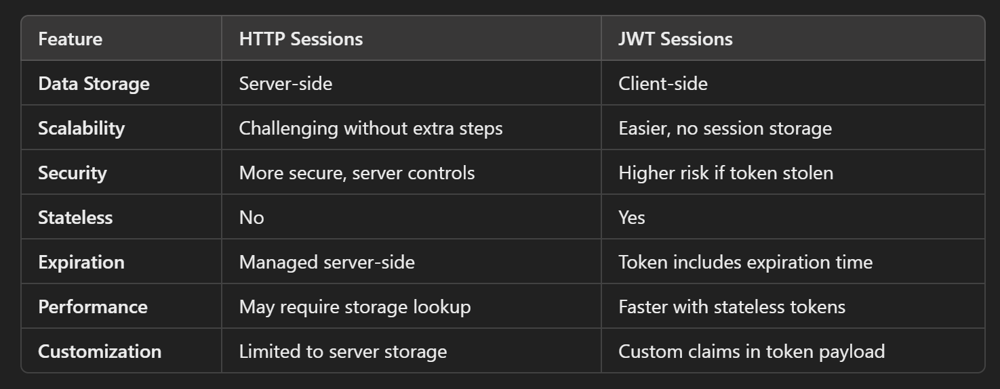

# Table of contents

- [Chapter III: Session Management in Spring Boot](#chapter-iii-session-management-in-spring-boot)
    * [Introduction](#introduction)
    * [Comparing HTTP and JWT Sessions](#comparing-http-and-jwt-sessions)
    * [HTTP Sessions in Spring Boot](#http-sessions-in-spring-boot)
    * [JWT Session in Spring Boot](#jwt-session-in-spring-boot)
       + [Example Implementation](#example-implementation)
    

# Chapter III: Session Management in Spring Boot

## Introduction

Session management is crucial for **maintaining user state across multiple requests** in web applications. It allows servers to remember user information, enhancing the user experience by preventing repeated logins and data entries. This chapter covers 2 approaches to session management in Spring Boot: HTTP sessions and JSON Web Tokens (JWT) sessions.

Now let's take a look at the 2 technologies.

## Comparing HTTP and JWT Sessions

A direct comparison between HTTP sessions and JWT-based sessions reveals distinct advantages and challenges for each method:

* **HTTP Sessions**:  
  * **Use Case**: Suitable for applications with limited traffic and straightforward session management needs.  
  * **Scalability**: Less scalable in distributed environments due to session data storage requirements.  
* **JWT**:  
  * **Use Case**: Ideal for microservices and applications requiring high scalability and statelessness.  
  * **Security**: More complex token management but can offer better performance in distributed systems.

 

## HTTP Sessions in Spring Boot

<u>How HTTP Sessions Work?</u>

HTTP sessions rely on the server storing session data associated with a **unique session ID**. When a user logs in, the server creates a session and generates a session ID, which is sent to the client as a cookie. This session ID is included in subsequent requests, allowing the server to recognize the user and maintain state.

### Advantages of Using HTTP Sessions

* **Simplicity**: HTTP sessions are straightforward to implement, with automatic management of session state by the server.  
* **Built-in Expiration**: Sessions can be configured to expire after a period of inactivity, enhancing security.

### Challenges and Limitations of HTTP Session-Based Management

* **Scalability Issues**: In distributed environments, maintaining session data across multiple servers can lead to scalability challenges.  
* **Memory Overhead**: High traffic can cause significant memory usage on the server as session data accumulates.

**Example:** Configuring HTTP Sessions in Spring Boot

To configure HTTP sessions in a Spring Boot application, include the following in the `application.yml` file:
```yml
server:
  servlet:
    session:
      timeout: 30m # Set session timeout to 30 minutes
```
The following code ensures that 
- all requests to the application are authenticated  
- configures session management to create sessions only when necessary
```java
@Configuration
@EnableWebSecurity
public class SecurityConfig {

    @Bean
    public SecurityFilterChain securityFilterChain(HttpSecurity http) throws Exception {
        http
            .authorizeRequests(authorizeRequests -> authorizeRequests.anyRequest().authenticated()
            )
            .sessionManagement(sessionManagement ->
                sessionManagement
                    .sessionCreationPolicy(SessionCreationPolicy.IF_REQUIRED)
            );
        return http.build();
    }
}
```
## JWT Session in Spring Boot

<u>How JWT Works for Stateless Session Management?</u>

JSON Web Tokens provides a stateless mechanism for managing sessions. It encodes user information in a **signed token** that is sent to the client. The client stores this token and includes it in the Authorization header of subsequent requests or saves it in a cookie/local storage, allowing the server to authenticate the user without maintaining session state.

### **Advantages** of Using JWT for Session Management

* **Statelessness**: No session data is stored on the server, making it easier to scale applications horizontally.  
* **Performance**: Reduces server load since there is no need to manage session state.

### **Challenges and Security Considerations** with JWT

* **Token Expiration**: Proper management of token expiration and renewal is essential to maintain security.  
* **Token Interception**: If tokens are not transmitted securely, they can be intercepted by malicious actors.

<br>

## Example Implementation 
To implement JWT in a Spring Boot application, start by adding the necessary dependencies in `pom.xml`:
```xml
<dependencies>  
    <dependency>  
        <groupId>io.jsonwebtoken</groupId>  
        <artifactId>jjwt</artifactId>  
        <version>0.9.1</version>  
    </dependency>  
    <dependency>  
        <groupId>org.springframework.boot</groupId>  
        <artifactId>spring-boot-starter-security</artifactId>  
    </dependency>  
</dependencies>
```
Next, create a utility class for JWT operations: create, validate and analyze JWT tokens, using a secret key to keep the information in the token secure.
```java
@Component  
public class JwtUtil {  
    private final String SECRET_KEY = "your_secret_key";  
    private final long EXPIRATION_TIME = 1000 * 60 * 60;

    public String generateToken(String username) {  
        return Jwts.builder()
                .setSubject(username)  
                .setIssuedAt(new Date(System.currentTimeMillis()))  
                .setExpiration(new Date(System.currentTimeMillis() + EXPIRATION_TIME))  
                .signWith(SignatureAlgorithm.HS256, SECRET_KEY)  
                .compact(); 
    }

    public boolean validateToken(String token, String username) {  
        String extractedUsername = extractUsername(token);  
        return (extractedUsername.equals(username) && !isTokenExpired(token));  
    }

    private boolean isTokenExpired(String token) {
        return extractExpiration(token).before(new Date());  
    }

    private Date extractExpiration(String token) {`  
        return Jwts.parser().setSigningKey(SECRET_KEY).parseClaimsJws(token).getBody().getExpiration();  
    }

    public String extractUsername(String token) {  
        return Jwts.parser().setSigningKey(SECRET_KEY).parseClaimsJws(token).getBody().getSubject();  
    }  
}
```
Create the AuthController to provide a JWT token upon valid user login, which allows the user to access the application's protected endpoints:
```java
@RestController  
public class AuthController {

    @Autowired  
    private AuthenticationManager authenticationManager;

    @Autowired  
    private JwtUtil jwtUtil;

    @PostMapping("/authenticate")  
    public String authenticate(@RequestBody AuthRequest authRequest) throws Exception {  
        try {  
            authenticationManager.authenticate(  
                    new UsernamePasswordAuthenticationToken(authRequest.getUsername(), authRequest.getPassword())  
            );  
        } catch (Exception e) {  
            throw new Exception("Invalid login credentials", e);  
        }  
        return jwtUtil.generateToken(authRequest.getUsername()); 
    }  
}
```
Verifying JWT in API Requests: <br>
JwtRequestFilter intercepts each request, extracts and verifies the JWT token in the Authorization header . If the token is valid, it sets up an authentication for the user in the security context of the application, allowing access to protected endpoints.
```java
public class JwtRequestFilter extends OncePerRequestFilter {

    @Autowired  
    private JwtUtil jwtUtil;

    @Autowired  
    private UserDetailsService userDetailsService;

    @Override  
    protected void doFilterInternal(HttpServletRequest request, HttpServletResponse response, FilterChain chain)  
            throws ServletException, IOException {  
        final String authorizationHeader = request.getHeader("Authorization");  
        String username = null;  
        String jwt = null;

        if (authorizationHeader != null && authorizationHeader.startsWith("Bearer ")) {  
            jwt = authorizationHeader.substring(7);  
            username = jwtUtil.extractUsername(jwt);  
        }

        if (username != null && SecurityContextHolder.getContext().getAuthentication() == null) { 
            UserDetails userDetails = userDetailsService.loadUserByUsername(username);  
            if (jwtUtil.validateToken(jwt, userDetails.getUsername())) {  
                UsernamePasswordAuthenticationToken authToken =  
                        new UsernamePasswordAuthenticationToken(userDetails, null, userDetails.getAuthorities());  
                SecurityContextHolder.getContext().setAuthentication(authToken);  
            }  
        } 
        chain.doFilter(request, response);  
    }  
}
```


### Conclusion 

Understanding session management is crucial for developing secure and efficient applications. In the context of HTTP sessions and JWTs, Spring Boot provides a straightforward and adaptable approach to managing sessions. Depending on the application's scalability and distributed requirements, sessions can be stored in memory, in a database, or in Redis, ensuring that the session management strategy aligns with security and performance goals.